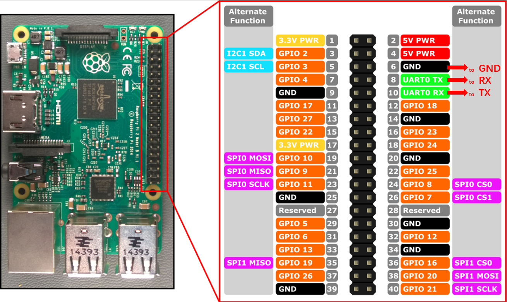

# Boat-Obstacle-Avoidance
## Description
This repository contains scripts that allow you to use the Luxonis OAK-D series camera as a visual obstacle avoidance sensor for ArduPilot boats. It also provides precompiled AI models for water segmentation required by the scripts. For now, you will need a companion computer like Raspberry Pi.


## Prepare
### Software:
- Python 3.9+ is recommended.
- Clone this repository, then run in its root:
    ```console
    sudo apt install python3-pip libatlas-base-dev python3-opencv
    pip install -U --prefer-binary -r requirements.txt
    ```

### Hardware (Raspberry Pi):
- Wiring diagram:

- Open Raspberry Pi's UART:
    - Run:
        ```console
        sudo raspi-config
        ```
    - Select: `Interface Options`->`Serial Port`->(serial login shell) `No`->(enable serial port) `Yes`
- Add this to `/boot/config.txt`, then reboot:
    ```text
    dtoverlay=miniuart-bt
    ```


## Usage
### Executables:
- **main.py**: Main script running on the companion computer.
- **test.py**: Visualization only.

### Configurations:
The settings are stored in **config.yaml**.
- DEVICE_STR: Interface to use. See [connection_string](https://mavlink.io/en/mavgen_python/#connection_string).
- BAUD_RATE: UART baud rate (if using serial).
- MESSAGE_RATE_MAX: Max reporting frequency, in Hz.
- MODEL_PATH: Path to the blob.
- GRID_NUM: Detection grid number on the vertical and horizontal axis (**must be compatible with the blob**).
- ISP_SCALE: See [setIspScale](https://docs.luxonis.com/projects/api/en/latest/components/nodes/color_camera/#:~:text=setIspScale%28*,numerator%2C%20denominator%3E%20tuples). The scaled resolution must be bigger than the model's input. Using the same aspect ratio is highly recommended, or it will result in losing FOV.
- EXTENDED_DISPARITY, SUBPIXEL: [Stereo mode](https://docs.luxonis.com/projects/api/en/latest/components/nodes/stereo_depth/). **You can only open at most one of them**.
    - Extended disparity mode allows detecting closer distance objects for the given baseline.
    - Subpixel mode improves the precision and is especially useful for long range measurements. It also helps for better estimating surface normals.
- CONFIDENCE_THRESHOLD: 0-255, depth confidence threshold.
- MIN_DISTANCE: Min depth threshold, in m.
- MAX_DISTANCE: Max depth threshold, in m.
- DECIMATION_FACTOR, SPECKLE_FILTER, TEMPORAL_FILTER, SPATIAL_FILTER: [Depth filters](https://docs.luxonis.com/projects/api/en/latest/components/nodes/stereo_depth/). **May significantly increase depth map's latency**.
    - Decimation Filter will sub-samples the depth map, which means it reduces the depth scene complexity and allows other filters to run faster.
    - Speckle Filter is used to reduce the speckle noise. Speckle noise is a region with huge variance between neighboring disparity/depth pixels, and speckle filter tries to filter this region.
    - Temporal Filter is intended to improve the depth data persistency by manipulating per-pixel values based on previous frames.
    - Spatial Edge-Preserving Filter will fill invalid depth pixels with valid neighboring depth pixels.
- USE_INTRINSIC: Choose whether to use [intrinsic matrix](https://docs.luxonis.com/en/latest/pages/tutorials/device-pointcloud/#on-device-pointcloud-nn-model) or [HFOV](https://docs.luxonis.com/projects/api/en/latest/components/nodes/spatial_location_calculator/) to calculate the x&y coefficient matrix.

### Troubleshooting
1.  ```console
    [warning] Insufficient permissions to communicate with X_LINK_BOOTLOADER device with name "1.1.3". Make sure udev rules are set
    ```
    Run:
    ```console
    echo 'SUBSYSTEM=="usb", ATTRS{idVendor}=="03e7", MODE="0666"' | sudo tee /etc/udev/rules.d/80-movidius.rules
    sudo udevadm control --reload-rules && sudo udevadm trigger
    ```
2. Something like **Couldn't read data from stream "__log"&"__timesync"**:

Check your power supply first. In my case, Raspberry Pi 400's USB can't provide enough power, and the DC jack on the OAK-D-IoT-75 can't work as auxiliary power normally. Please consider using a USB Y cable and individual 5V power adapter.


## AI Model
**Use a modified DDRNet [here](https://github.com/Chenghao-Tan/DDRNet).**
- Naming rules:
    - resolution (*W_H*)
    - resolution + grid number on each axis (*W_H_(GW_GH)*)
- Build your own model:
    - Follow the instructions in that repository (**Prepare->Training->Export ONNX**). Make sure **net.extra_process(True)** and remember to set **IO resolution and grid settings** properly.
    - Use the [blob converter](http://blobconverter.luxonis.com/) provided by Luxonis to convert the **ONNX** to **blob**. You can also use OpenVINO to do that locally (mo.py and compile_tool).
        - OpenVINO version: **2021.4**
        - model optimizer params: **--data_type=FP16**
        - compile params: **-ip U8**
        - shaves: **6** (CMX slices: also 6)


## OAK-D-IoT Branch
**WARNING: This branch CAN NOT work properly for a long time!**

You might want to check [OAK-D-IoT branch](https://github.com/Chenghao-Tan/Boat-Obstacle-Avoidance/tree/OAK-D-IoT) if you have OAK-D-IoT series cameras. Any help in debugging this branch is welcomed!
